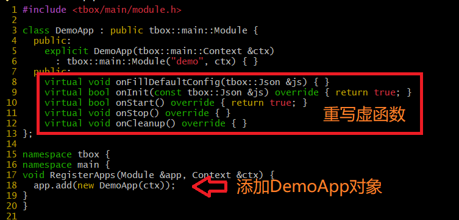
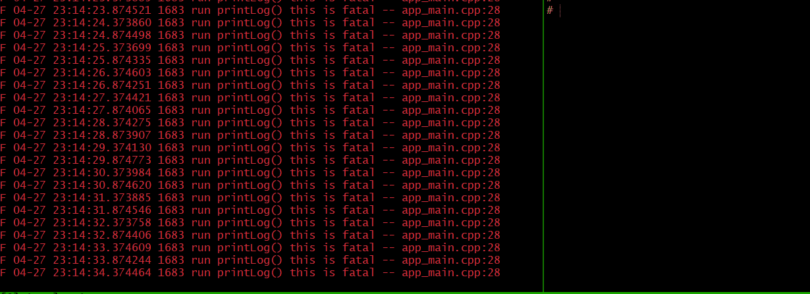

<p align="center">
  
</p>

[](LICENSE)
[](https://en.cppreference.com/)
[](https://img.shields.io/badge/platform-linux-lightgrey.svg)

[[English]](README.md)

全称: C++ Treasure Box,C++百宝箱,是一个基于 Reactor 模式的服务型 **开发框架** 与 **组件库**。  

# 应用场景

- **智能硬件**，如：机器人（扫地机、商用服务机器人）、IPC、无人机、车载等；
- **边缘计算组件**，如：智能家居网关、IOT边缘网关等；
- **后台服务型软件**，如：SOCKS5，见:[cpp-socks5](https://gitee.com/cpp-master/cpp-socks5)；

# 特点

## 1. 基于Reactor模型
参考 Node.js 的 Reactor 模式。  
主线程以 Reactor 模式处理非阻塞 IO 事件,并配合 ThreadPool 执行大运算与阻塞性操作。  
  
该模式避免了多线程模式竞态加锁的烦恼,程序稳定可靠。  

## 2. 内含main框架,开箱即用
使用内置的 main 框架处理了所有与业务无关的工作。您不需要关心日志怎么输出、参数怎么解析、程序怎么退出、main函数怎么写这些琐碎的事情。main框架都为您处理好了。  
您只需要派生`tbox::main::Module`类,填写业务代码,然后注册到框架即可。  


## 3. 具有类Shell的命令终端
可以与运行中的服务通过telnet进行交互,令其打印内部数据,或是执行特定的动作。这极大地降低了调试难度。  
  

## 4. 完备的日志系统
**1) 有三种日志输出渠道:stdout + filelog + syslog**  

- stdout，将日志通过 `std::cout` 输出到终端;
- syslog，将日志通过 `syslog()` 输出到系统日志;
- filelog，将日志写入到指定目录下,以格式:`前缀.年月日_时分秒.进程号.log` 的文件中。文件大小超过1M则另创建新的日志文件。由于写文件效率低,该输出渠道采用前后端模式。

三种渠道可以启动参数中选定一个或同时多种,也可在运行时通过终端更改。

**2) 根据日志等级渲染不同颜色,一目了然,内容详尽**  
日志内容包含了:等级、时间(精确到微秒)、线程号、模块名、函数名、正文、文件名、行号。  
方便快速定位问题。  
  

**3) 灵活的日志输出过滤器,且能运行时修改**  
可在程序运行时针对不同的模块单独设置日志等级,如下:  
  

## 5. 灵活的参数系统,以不变应万变
参数以JSON的格式提供，可以传入任何格式的运行参数，包括：整数、小数、字串、数组、组合参数，满足几乎所有参数传入需求：  
  
在执行时可以使用 `-c your_cfg_file.json` 导入JSON格式的配置文件。同时还可以使用配合 `-s 'xx.yy.zz=vvv'` 临时指定参数。  
而JSON格式的配置文件还支持include指令，在加载时去包含其它的配置文件。  

## 6. 跨线程委派任务,无需加锁
子线程委托主线程执行:  
  
主线程委托子线程执行:  
  

## 7. 支持优雅的退出流程
在接收到信号:SIGINT, SIGTERM, SIGQUIT, SIGPWR 时,会有序地执行退出流程,释放资源。做到干净地退出。   
  

## 8. 有全面的异常捕获机制
当程序出现各种程序异常,如:段错误、断言、总线错误、异常未捕获等,架框会捕获并在日志系统中打印完整的调用栈。面对程序崩溃,不再一脸茫然。效果如下:  
  

## 9. 有丰富的开发组件

| 库名 | 中文名 | 说明 |
|:----:|:---:|:----|
| base | 基础库 | 含日志打印、常用工具等 |
| util | 工具库 | 在业务代码中可能会用到的库 |
| event | 事件库 | 实现了IO,Timer,Signal三种事件驱动,是整个框架的心脏 |
| eventx | 事件扩展库 | 含 ThreadPool 线程池,WorkThread工作线程,TimerPool 定时器池等模块 |
| log | 日志输出库 | 实现了终端、syslog、文件形式的日志输出 |
| network | 网络库 | 实现了串口、终端、UDP、TCP 通信模块 |
| terminal | 终端 | 类似shell的命令终端,可实现运行时与程序进行命令交互 |
| **main** | 主框架 | 实现了完备的程序启动流程与框架,让开发者只需关心业务代码 |
| mqtt | MQTT客户端库 | |
| coroutine | 协程库 | 众所周知,异步框架不方便处理顺序性业务,协程弥补之 |
| http | HTTP库 | 在network的基础上实现了HTTP的Server与Client模块 |
| alarm | 闹钟模块 | 实现了4种常用的闹钟:CRON闹钟、单次闹钟、星期循环闹钟、工作日闹钟 |
| flow | 流程模块 | 含多层级状态机与行为树,解决异步模式下动行流程问题 |

# 适用环境

- Linux 系统;
- C++11 以上。

# 下载与构建

## 方法一：GNU Make
```
git clone https://gitee.com/cpp-master/cpp-tbox.git
cd cpp-tbox;
make 3rd-party modules RELEASE=1
```
完成之后，头文件与库文件都在 .staging 目录下。  
当然也可以通过指定 `STAGING_DIR` 对头文件与库文件的生成路径进行指定。  
如：
```
make 3rd-party modules RELEASE=1 STAGING_DIR=$HOME/.tbox
```
完成之后，头文件与库文件都在 $HOME/.tbox 路径下。

## 方法二：CMake
```
git clone https://gitee.com/cpp-master/cpp-tbox.git
cd cpp-tbox
cmake -B build
cmake --build build
cmake --install build
```
通过指定`CMAKE_INSTALL_PREFIX` 自定义安装目录(默认安装在/usr/local):
```
cmake -B build -DCMAKE_INSTALL_PREFIX=$HOME/.tbox
```

# 使用教程
关于如何使用 cpp-tbox 开发自己的程序，详见教程：
[cpp-tbox-tutorials](https://gitee.com/cpp-master/cpp-tbox-tutorials/blob/master/README_CN.md)  

# 外部库依赖

| 库名 | 依赖模块 | 必需 | 说明 | 安装方法 |
|:----:|:--------:|:--:| :----:|:--------:|
| libgtest-dev | 所有 | 否 | 单元测试用 | sudo apt install libgtest-dev |
| libgmock-dev | 所有 | 否 | 单元测试用 | sudo apt install libgmock-dev |
| mosquitto | mqtt | 否 | MQTT通信 | sudo apt install libmosquitto-dev |

# 配置
你可以决定哪些模块需要构建，哪些不需要。  
打开 config.mk 文件,将不需要模块对应 `app_y += xxx` 屏蔽即可,但要注意模块间的依赖性。

# 许可

[MIT](LICENSE),可免费商用。

# 反馈途径

- Issue: 任何问题都欢迎在issue里交流
- 微信: hevake\_lee
- QQ群: 738084942 (cpp-tbox 技术交流)

# 鼓励我

如果这个项目让您的工作更轻松、下班更早了，请您给我更多的鼓励。  
你可以做这些：  

- 给它点亮三连： Star, Watch, Fork；
- 向身边的同事与伙伴推荐，在技术论坛向您的读者推荐；
- 加入上面的QQ群、加我微信进入微信群；
- 积极反馈问题，提出建议；
- 参与项目的开发，贡献您的力量；
- 让我知道它被运用到了哪些的项目上；

